# Firebase Messenger App

A Flutter-based messaging application built with Firebase Authentication, Cloud Firestore, and the BLoC state management pattern. The project is structured around a modular feature-based architecture, providing clear separation between authentication, chat, user management, settings, notifications, and theming.

This repository represents an in-progress messaging platform. It currently supports core functionality such as account creation, login, chat messaging, and user blocking. Future iterations will integrate contact-based discovery so users can chat with people from their phone address book who also use the app.

## Features

### Authentication
- Create an account using username, email, and password (phone number authentication planned for later versions).
- Log in and log out.
- Delete an account.
- Real-time authentication state handling via Firebase Auth and AuthBloc.

<table>
<tr>
<td>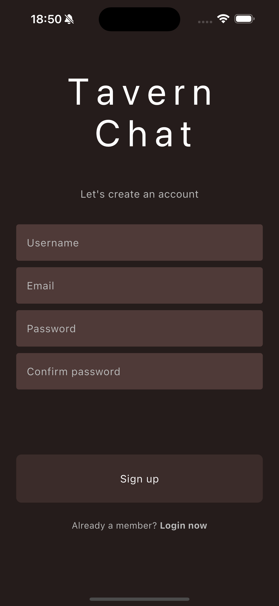</td>
<td>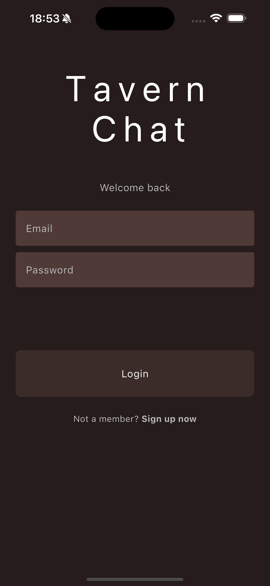</td>
<td>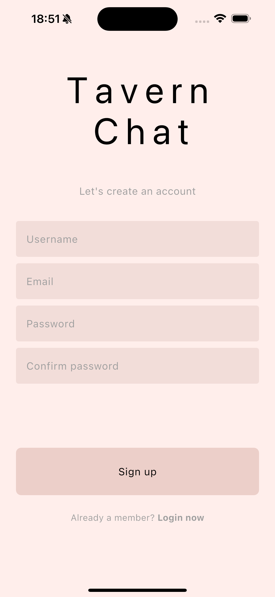</td>
<td>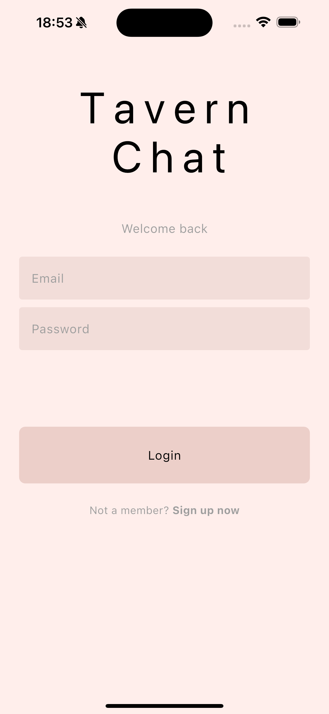</td>
</tr>
</table>

### Chat
- One-to-one messaging built on top of Cloud Firestore.
- Real-time updates for new messages and unread message counts.
- Message timestamps, date grouping, and read indicators.
- Displays all users for now, but will later show only contacts who use the app.

<table>
<tr>
<td>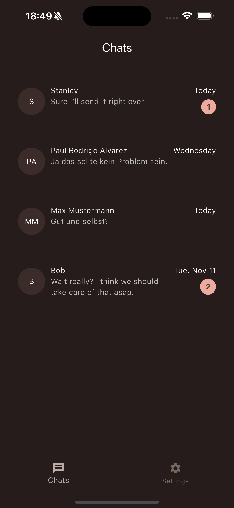</td>
<td>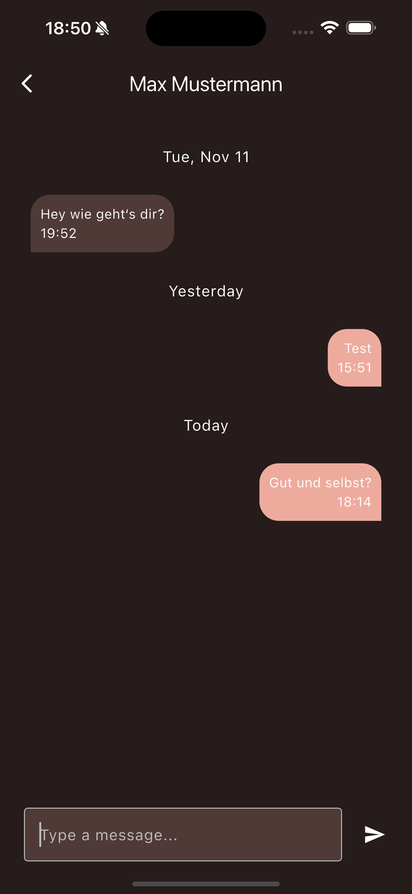</td>
<td>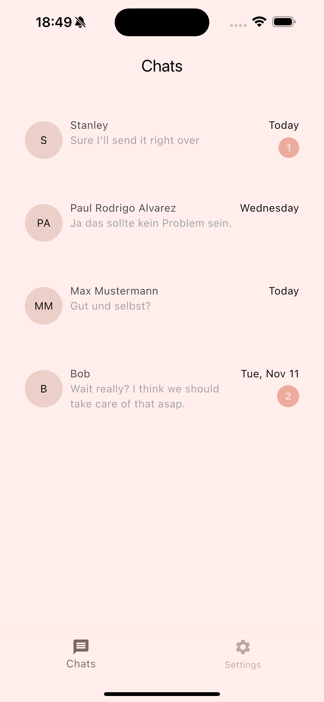</td>
<td>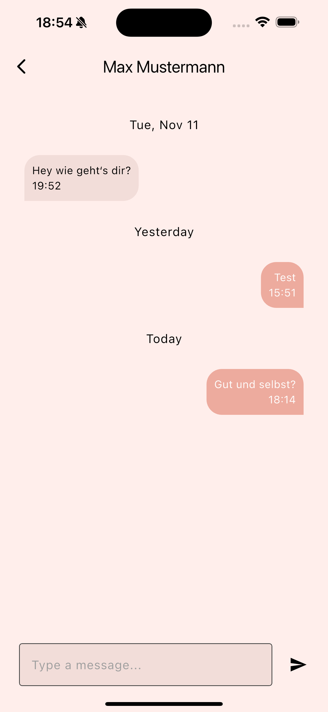</td>
</tr>
</table>

### User Management
- Fetch user data from Firestore.
- Display users in the chat list.
- Block and unblock users.
- User profiles with name and email.

### Settings
- Adjustable theme (light and dark mode).
- User profile screen including username and email.
- Section for blocked users.

<table>
<tr>
<td>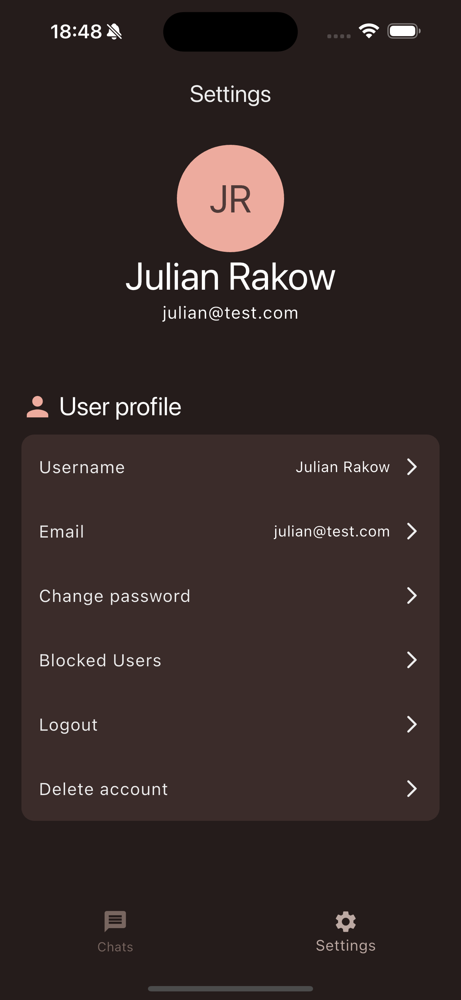</td>
<td>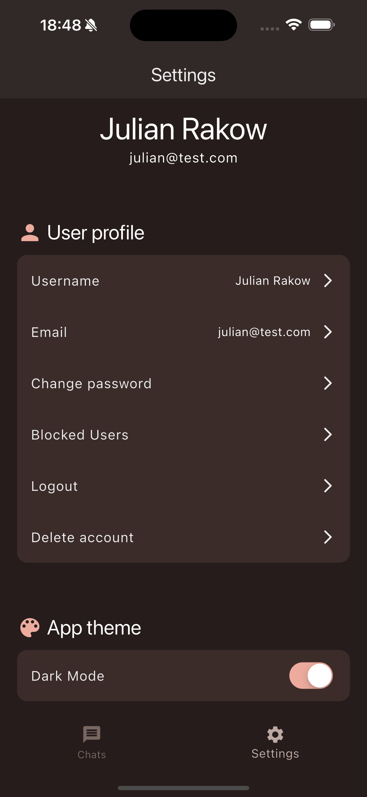</td>
<td>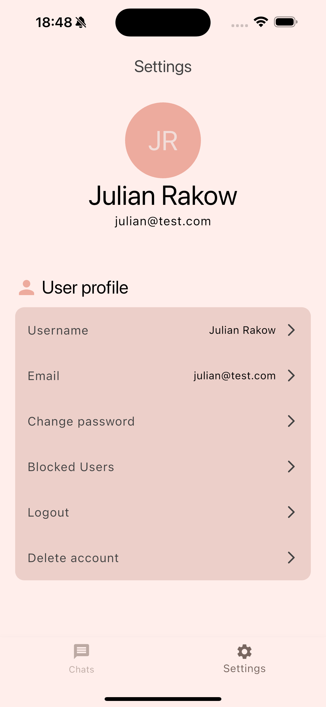</td>
<td>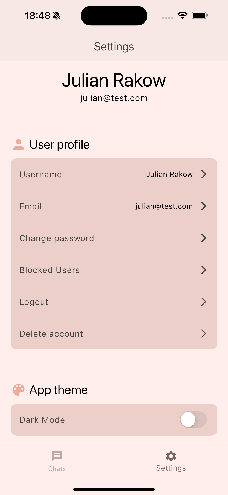</td>
</tr>
</table>

### Theming and UI
- Custom theme configuration (light and dark themes).
- Centralized color definitions.
- Reusable widgets such as input fields, buttons, tiles, and list views.
- Scaffold with drawer navigation.
- Clean feature-based architecture.

## Project Structure

The project is organized into a feature-first directory structure:
<pre>
<code>
lib
├── core
│   ├── custom_button_style.dart
│   └── theme
│       ├── custom_colors.dart
│       ├── dark_theme.dart
│       ├── light_theme.dart
│       └── theme_cubit.dart
├── features
│   ├── auth
│   ├── chat
│   ├── notifications
│   ├── settings
│   └── users
├── firebase_options.dart
├── main.dart
├── main_app.dart
├── navigation_scaffold.dart
└── utils
</code>
</pre>

Each feature contains its own:
- Bloc or Cubit state management logic
- Data layer (models, providers, repositories)
- Presentation layer (screens and widgets)

This approach improves code organization, scalability, and testability as the application evolves.

## Technologies Used

- Flutter (Material and Cupertino components)
- Firebase Authentication
- Cloud Firestore
- Firebase Messaging
- flutter_bloc and bloc_test for state management and testing
- Shared Preferences for local settings
- RXDart for stream transformations
- intl for date formatting

## Getting Started

### Prerequisites
- Flutter SDK (3.6.0 or higher)
- A Firebase project configured with:
  - Firebase Authentication
  - Cloud Firestore
  - Firebase Cloud Messaging
- Generated `firebase_options.dart` file via FlutterFire CLI

### Installation

1. Clone the repository  
   `git clone https://github.com/your-repo/messenger_app.git`

2. Install dependencies  
   `flutter pub get`

3. Run the application  
   `flutter run`

Ensure that your Firebase project is correctly linked before running the app.

## Future Plans

- Profile customization.
- Media sharing (images, videos).
- Group chats.
- Replace email/password login with phone number authentication.
- Contact discovery to show only users from the device address book.
- Push notifications for messages.